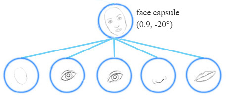

# CNN Short-coming
In the introduction section of [the previous atricle](./routing_paper.html) we described the short-comings of CNN. Let's recap some of them.

To handle the different variants of objects, e.g. different orientations of face, we need to add more neurons and layers to the network. It also requires large dataset to incorporate multiple variants of object. MNist dataset contains 5500 samples per digit. Human brain do not need that many samples to learn recognizing digits.

CNN is also vulnerable to adversaires by simple move, rotate or resize individual feature, as they do not uses spacial relations between this features. Via, adding small noise to the original image we can generate images that are undistiguisable by human eyes and fools a CNN network.

# Capsule

A capsule captures the likeliness of feature and its variant. So it does not only detect a feature, but its variants as well. 

e.g. the same network can detect a face rotated my 20$^\circ$ clockwise as well as anticlockwise.

Equivariance is the detection of objects that can transform to each other. Unlike CNNs, the capsule network detects that the face is rotaed clockwise 20$^\circ$ rather than just detecting the face. Since the same capsule is trained to learn the feature variant rather than feature only, it needs less data and also a smaller network is sufficient. For euivariance, it's needed to keep spacial information of feature inside neuron, which  also helps to prevent adversarial attacks.

# Matrix capsule

A matrix capsule captures the activation(likeliness) as well as a 4x4 pose matrix, which stores translation and rotation information of an object. e.g. the image below shows different objects from different viewpoints, which shows the pose information asentially represents viepoint of the feature.

# Methodology

Simillar to the previous paper, here as also capsules have two main features:
1. Transformation matrix:
We use a viwpoint invariant 4x4 transformation matrix that is used to generate votes for the pose matrix of the higher layer capsule from the lower layer capsule.

In the face detection example, each of the lower layer capsules namely mouth, eyes and nose capsules make predictions about the pose matrix of the higher layer capsule, i.e. face capsule. A vote matrix is the predicted value of pose matrix of the face capsule, which is computed by multiplying the lower layer capsule's pose matrix with a transformation matrix, which is learnt using standard backpropogation.

2. Routing:
For matrix capsule, EM routing machanism is used to find the pose matrix of a capsule from the vote matrices, in which we use the standard clustering technique EM(Expectation-maximization). EM clustering is used to cluster datapoints into Gaussian distributions.

_yay_

[back](./)
