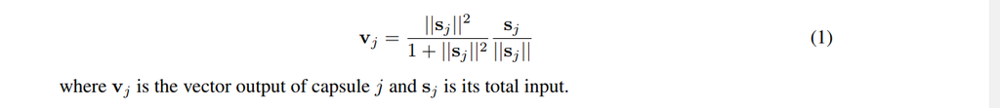

# Introduction

Deep Convolutional Neural Networks are present state of the art in lot of tasks like classification, localization, segmentation, etc to name a few. 
In deep learning, the activation of a neuron can be interpreted as possibility of that feature being detected. CNN’s are excellent at detecting features but are less effective at learning good hierarchical relationship of features. To make the idea of good hierarchial relationships clear take a look at this picture 


Say we are doing an image classification task of human face, a well trained CNN might say the above picture is human, why does it might say so?. When CNN looks at the image the neurons associated with detection of nose, mouth, eyes will all get activated. These activated neurons will activate the face detector neuron and leading CNN to wrongly classify above artificially constructed image as a human. 

Now let's suppose at each neuron we have more information of feature detected like size, orientation, etc it would help model in correctly solving artificially created examples like above. The technical term used for this is **capsules** i.e. which outputs a vector instead of a scalar like neuron.

# Equivariance:

Equivariance mean internal representation captures the properties of the object. A CNN model uses multiple neurons and layers in capturing different feature’s variants, as shown in fig below, due to which it requires data for multiple variants. 


A capsule network shares the same capsule to detect multiple variants as above. As Capsules for lower level objects (i.e. eyes, mouth, nose, etc) stores the spatial information and using a viewpoint invariant transformation generate the same for the higher level objects, it needs one capsule for all the variants of features as well as less data to get trained. In the normal CNN's the features are represented by a single neuron (single dimension) where in capsules are by a vector (atleast 2 dimensions) and so the internal representation might capture the properties of the object, leading to equivariance. 

# Methodology

## Capsule

A Capsule is a group of neurons that captures both the likelihood and parameters of a feature. The output vector of a capsule is called as the activity vector with magnitude represents the probability of detecting a feature and its orientation represents its properties.

## Inputs and Outputs of a Capsule

We want the length of the output vector to represent the probability of feature. We therefore use the below non-linear **squashing** function to ensure this.



Except the first layer of capsules $$e^{i\pi} + 1 = 0$$


Capsules have two main features as described below:
Transformation matrix
As discussed in the introduction section, while finding the output of higher layer capsules, we first predict it using lower layer capsules using a viewpoint invariant transformation matrix. for all the capsules in the lower layer, we multiply the transformation matrix with the output of the capsule to get a vote for the higher layer capsule. This matrix is learnt using backpropagation.
E.g. Let’s assume we have two 1D capsules representing the width of mouth and left eye and Wm=2, We=3, and we calculate votes for face capsule from the mouth and the eye capsule as:
Vm=Wm×widthm=2×100=200 and Ve=We×widthe=3×66=198

Dynamic routing
Once we have the votes for the higher layer capsule from all the lower layer capsules, we find the true output, via a routing mechanism in which it analyses all the votes and gets them the most probable output. The sparsity of the votes leads to the low confidence of the capsule output, which is represented as a lower norm of the output vector.

Here, the vector Vj is the output of the higher layer capsule, which is getting updated iteratively. Vj is computed by taking a weighted sum of the votes from lower layer capsules, where the weighted Cij are also getting updated in each iteration. We are starting with equal weights and after computing Vj, we increase the weight to the more accurate votes and decrease the weights to the less accurate ones.


Since here we are predicting the higher layer capsule output using the lower layer ones, the votes will get transformed with the same transformation we applied to the image, and since all the votes are going through the same transformation as shown in the figure above, it will not affect the classification probability.
While in the case of deformed face the transformation of votes from the ideal face-votes will be different across the different features, which will reduce the norm of the output vector of higher layer capsules and hence the classification probability.


# References

[Understanding Dynamic Routing between Capsules](https://jhui.github.io/2017/11/03/Dynamic-Routing-Between-Capsules/)

[back](./)


Text can be **bold**, _italic_, or ~~strikethrough~~.

[Link to another page](./another-page.html).

There should be whitespace between paragraphs.

There should be whitespace between paragraphs. We recommend including a README, or a file with information about your project.

# Header 1

This is a normal paragraph following a header. GitHub is a code hosting platform for version control and collaboration. It lets you and others work together on projects from anywhere.

## Header 2

> This is a blockquote following a header.
>
> When something is important enough, you do it even if the odds are not in your favor.

### Header 3

```js
// Javascript code with syntax highlighting.
var fun = function lang(l) {
  dateformat.i18n = require('./lang/' + l)
  return true;
}
```

```ruby
# Ruby code with syntax highlighting
GitHubPages::Dependencies.gems.each do |gem, version|
  s.add_dependency(gem, "= #{version}")
end
```

#### Header 4

*   This is an unordered list following a header.
*   This is an unordered list following a header.
*   This is an unordered list following a header.

##### Header 5

1.  This is an ordered list following a header.
2.  This is an ordered list following a header.
3.  This is an ordered list following a header.

###### Header 6

| head1        | head two          | three |
|:-------------|:------------------|:------|
| ok           | good swedish fish | nice  |
| out of stock | good and plenty   | nice  |
| ok           | good `oreos`      | hmm   |
| ok           | good `zoute` drop | yumm  |

### There's a horizontal rule below this.

* * *

### Here is an unordered list:

*   Item foo
*   Item bar
*   Item baz
*   Item zip

### And an ordered list:

1.  Item one
1.  Item two
1.  Item three
1.  Item four

### And a nested list:

- level 1 item
  - level 2 item
  - level 2 item
    - level 3 item
    - level 3 item
- level 1 item
  - level 2 item
  - level 2 item
  - level 2 item
- level 1 item
  - level 2 item
  - level 2 item
- level 1 item

### Small image


### Large image


### Definition lists can be used with HTML syntax.

<dl>
<dt>Name</dt>
<dd>Godzilla</dd>
<dt>Born</dt>
<dd>1952</dd>
<dt>Birthplace</dt>
<dd>Japan</dd>
<dt>Color</dt>
<dd>Green</dd>
</dl>

```
Long, single-line code blocks should not wrap. They should horizontally scroll if they are too long. This line should be long enough to demonstrate this.
```

```
The final element.
```
