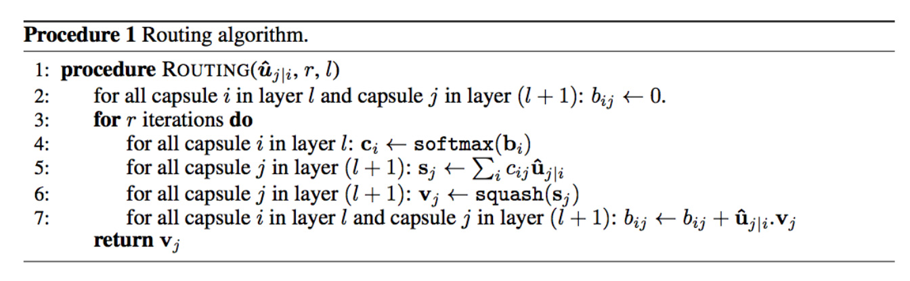

# Introduction

Deep Convolutional Neural Networks are present state of the art in lot of tasks like classification, localization, segmentation, etc to name a few. 
In deep learning, the activation of a neuron can be interpreted as possibility of that feature being detected. CNN’s are excellent at detecting features but are less effective at learning good hierarchical relationship of features. To make the idea of good hierarchial relationships clear take a look at this picture 


Say we are doing an image classification task of human face, a well trained CNN might say the above picture is human, why does it might say so?. When CNN looks at the image the neurons associated with detection of nose, mouth, eyes will all get activated. These activated neurons will activate the face detector neuron and leading CNN to wrongly classify above artificially constructed image as a human. 

Now let's suppose at each neuron we have more information of feature detected like size, orientation, etc it would help model in correctly solving artificially created examples like above. The technical term used for this is **capsules** i.e. which outputs a vector instead of a scalar like neuron.

# Equivariance:

Equivariance mean internal representation captures the properties of the object. A CNN model uses multiple neurons and layers in capturing different feature’s variants, as shown in fig below, due to which it requires data for multiple variants. 


A capsule network shares the same capsule to detect multiple variants as above. As Capsules for lower level objects (i.e. eyes, mouth, nose, etc) stores the spatial information and using a viewpoint invariant transformation generate the same for the higher level objects, it needs one capsule for all the variants of features as well as less data to get trained. In the normal CNN's the features are represented by a single neuron (single dimension) where in capsules are by a vector (atleast 2 dimensions) and so the internal representation might capture the properties of the object, leading to equivariance. 

# Methodology

## Capsule

A Capsule is a group of neurons that captures both the likelihood and parameters of a feature. The output vector of a capsule is called as the activity vector with magnitude represents the probability of detecting a feature and its orientation represents its properties.

## Inputs and Outputs of a Capsule

We want the length of the output vector to represent the probability of feature. We therefore use the below non-linear **squashing** function to ensure this.


For finding the input to higher layer capsules, we first calculate prediction vectors then do weighted sum of prediction vectors with coupling coefficients. Let's look at capsule j in an layer L and let's look at capsule i in layer L-1. We have a weight matrix between i and j called Wij which will be learned by backpropagation. For calculating the prediction vector between i and j multiply Wij by output of capsule i. We also have coupling coefficients for all i,j pairs, we then do the weighted sum with coupling factors as weights over all i to j, resulting in input vector to capsule j. We will look at coupling coefficients shortly.     


Now let's look at routing procedure:
1. Firstly we initialize all logits between i,j pairs to 0
2. We run the below procedure for fixed number of times
   1. We get all the coupling coefficients pairs i,j by softmax on logits
   2. We calculate the input to all j's by (2)
   3. We calculate output by squashing (1) which we call as output
   4. We update the logits. We will see next how do we update
3. return the output

The updation of logits is done as follows: we have the prediction vector between i and j, output of j vector. We do a dot product between both of them and add the dot product to that pair logit. The coupling coefficients between capsule i and all the capsules in the layer above sum to 1. 



We use dynamic routing to compute the output of a capsule. We compute cij to quantify the connection between a capsule and its parent capsules. This value is important but short lived. To calculate a capsule output, training or testing, we always redo the dynamic routing calculation. 


# References

[Understanding Dynamic Routing between Capsules](https://jhui.github.io/2017/11/03/Dynamic-Routing-Between-Capsules/)

[back](./)


Text can be **bold**, _italic_, or ~~strikethrough~~.

[Link to another page](./another-page.html).

There should be whitespace between paragraphs.

There should be whitespace between paragraphs. We recommend including a README, or a file with information about your project.

# Header 1

This is a normal paragraph following a header. GitHub is a code hosting platform for version control and collaboration. It lets you and others work together on projects from anywhere.

## Header 2

> This is a blockquote following a header.
>
> When something is important enough, you do it even if the odds are not in your favor.

### Header 3

```js
// Javascript code with syntax highlighting.
var fun = function lang(l) {
  dateformat.i18n = require('./lang/' + l)
  return true;
}
```

```ruby
# Ruby code with syntax highlighting
GitHubPages::Dependencies.gems.each do |gem, version|
  s.add_dependency(gem, "= #{version}")
end
```

#### Header 4

*   This is an unordered list following a header.
*   This is an unordered list following a header.
*   This is an unordered list following a header.

##### Header 5

1.  This is an ordered list following a header.
2.  This is an ordered list following a header.
3.  This is an ordered list following a header.

###### Header 6

| head1        | head two          | three |
|:-------------|:------------------|:------|
| ok           | good swedish fish | nice  |
| out of stock | good and plenty   | nice  |
| ok           | good `oreos`      | hmm   |
| ok           | good `zoute` drop | yumm  |

### There's a horizontal rule below this.

* * *

### Here is an unordered list:

*   Item foo
*   Item bar
*   Item baz
*   Item zip

### And an ordered list:

1.  Item one
1.  Item two
1.  Item three
1.  Item four

### And a nested list:

- level 1 item
  - level 2 item
  - level 2 item
    - level 3 item
    - level 3 item
- level 1 item
  - level 2 item
  - level 2 item
  - level 2 item
- level 1 item
  - level 2 item
  - level 2 item
- level 1 item

### Small image


### Large image


### Definition lists can be used with HTML syntax.

<dl>
<dt>Name</dt>
<dd>Godzilla</dd>
<dt>Born</dt>
<dd>1952</dd>
<dt>Birthplace</dt>
<dd>Japan</dd>
<dt>Color</dt>
<dd>Green</dd>
</dl>

```
Long, single-line code blocks should not wrap. They should horizontally scroll if they are too long. This line should be long enough to demonstrate this.
```

```
The final element.
```
