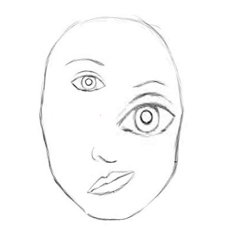
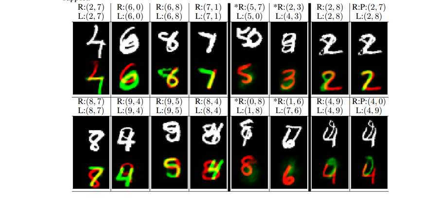

# Introduction

Deep Convolutional Neural Networks are the present state of the art in a lot of tasks like classification, localization, segmentation, etc to name a few. 
In deep learning, the activation of a neuron can be interpreted as the possibility of that feature being detected. CNN's are excellent at detecting features but are less effective at learning the good hierarchical relationship of features. To make the idea of good hierarchical relationships clear, take a look at this picture. 

Say, we are doing an image classification task of a human face. A well trained CNN might say that the above picture is human. Why does it say so? When CNN looks at the image, the neurons associated with detection of nose, mouth and eyes will all get activated. These activated neurons will then activate the face detector neuron, leading CNN to wrongly classify above artificially constructed image as a human. 

Now, let's suppose at each neuron we have more information of feature detected like size, orientation, etc, it would help model correctly solving artificially created examples like above. The technical term used for this is **capsules** i.e. which outputs a vector instead of a scalar like a neuron.

## Equivariance:

Equivariance means internal representation captures the properties of the object. A CNN model uses multiple neurons and layers in capturing different feature’s variants, as shown in fig below, due to which it requires data for multiple variants. 

A capsule network shares the same capsule to detect multiple variants as above. As Capsules for lower level objects (i.e. eyes, mouth, nose, etc) stores the spatial information and using a viewpoint invariant transformation generate the same for the higher level objects, it needs one capsule for all the variants of features as well as less data to get trained. In the normal CNN's the features are represented by a single neuron (single dimension) wherein capsules are by a vector (at least 2 dimensions). In computer graphics, we have an object and instantiation parameters,  we then get the image by rendering. In CapsNet , we are trying to do exactly opposite. We have an image, we are learning the instantiation parameters, this would be helpful a lot in tasks like detection and segmentation. CapsNet is learning the instantiation parameters and so changes in the input will be reflected in activation vectors which is equivariance. 

# Methodology

## Capsule

A Capsule is a group of neurons that captures both the likelihood and parameters of a feature. The output vector of a capsule is called as the activity vector with magnitude represents the probability of detecting a feature and its orientation represents its properties.

## Inputs and Outputs of a Capsule

We want the length of the output vector to represent the probability of feature. We, therefore, use the below non-linear **squashing** function to ensure this.

For finding the input to higher layer capsules, we first calculate prediction vectors and then do a weighted sum of prediction vectors with coupling coefficients. Let's look at capsule j in a layer L and let's look at capsule i in layer L-1. We have a weight matrix between i and j called Wij which will be learned by backpropagation. For calculating the prediction vector between i and j, multiply Wij by the output of capsule i. We also have coupling coefficients for all i,j pairs, we then do the weighted sum with coupling factors as weights over all i to j, resulting in input vector to capsule j. We will look at coupling coefficients shortly.     

Now let's look at routing procedure:
1. Firstly we initialize all logits between i,j pairs to 0
2. We run the below procedure for a fixed number of times
   1. We get all the coupling coefficients pairs i,j by softmax on logits
   2. We calculate the input to all j's by (2)
   3. We calculate output by squashing (1) which we call as output
   4. We update the logits. We will see next how do we update
3. return the output

The updation of logits is done as follows: we have the prediction vector between i and j, the output of j vector. We do a dot product between both of them and add the dot product to that pair logit. The coupling coefficients between capsule i and all the capsules in the layer above sum to 1. 

We use dynamic routing to compute the output of a capsule. We compute cij to quantify the connection between a capsule and its parent capsules. This value is important but short lived. To calculate a capsule output, training or testing, we always redo the dynamic routing calculation. 

## Loss Function

The length of the vector represents the probability that a capsule’s entity exists. We would like the top-level capsule for digit class k to have a long instantiation vector if and only if that digit is present in the image. 

where Tk = 1 iff a digit of class k is present and m+ = 0.9 and m− = 0.1. The λ down-weighting of the loss for absent digit classes stops the initial learning from shrinking the lengths of the activity vectors of all the digit capsules. We use λ = 0.5. The total loss is simply the sum of the losses of all digit capsules.

## CapsNet Architecture

First for the image 9X9 conv, 256 output channels, no padding, stride one, applied on 28X28 image resulting in output of 20X20X256. The second layer (PrimaryCapsules) is a convolutional capsule layer with 32 channels of convolutional 8D capsules (i.e. each primary capsule contains 8 convolutional units with a 9 × 9 kernel and a stride of 2). To make convolutional capsule layer more clear, since it's 8 dimension capsule here 8 normal 9X9 convs with 32 output channels, stride 2, zero padding are applied. Then the resulting 8 blocks of 6X6X32 are concatenated resulting in 6X6X32X8. Then the squashing function is applied to this. We have the weight matrix with 8X16 dimensions. The DigitCaps layer is 10 capsules same as number of digits and each capsule is 16D and each of these capsules receives input from all the capsules in the layer below. The max norm capsule is taken as the output of model. 

### Reconstruction as Regularization method

We use an additional reconstruction loss to encourage the digit capsules to encode the instantiation parameters of the input digit. During training, we mask out all but the activity vector of the correct digit capsule. Then we use this activity vector to reconstruct the input image. The output of the digit capsule is fed into a decoder. We minimize the sum of squared differences between the outputs of the logistic units and the pixel intensities. We scale down this reconstruction loss by 0.0005 so that it does not dominate the margin loss during training.

From the picture itself, the architecture is clear, unlike the Encoder part. The whole architecture is both encoder and decoder. We will look at the results of this whole in the next part. 

## CapsNet on MNIST

Training is performed on 28 × 28 MNIST images that have been shifted by up to 2 pixels in each direction with zero padding. No other data augmentation/deformation is used.

The baseline is a standard CNN with three convolutional layers of 256, 256, 128 channels. Each has 5x5 kernels and stride of 1. The last convolutional layers are followed by two fully connected layers of size 328, 192. The last fully connected layer is connected with dropout to a 10 class softmax layer with cross-entropy loss. The baseline is trained on 2-pixel shifted MNIST with Adam optimizer.

The CapsNet is the above architecture. The paper gets a low test error (0.25%) on a 3 layer network previously only achieved by deeper networks. This implementation gave the lowest error of 0.55% 

Above shows the test error rate on MNIST for different CapsNet settings and shows the importance of routing, reconstruction. Adding the reconstruction forces the network to keep the important information till the end into the capsule vector. The model does good reconstruction as well as expected.  

The next experiment is an interesting one, in this, the aim is to understand what some of the dimensions of capsules might represent. We are passing only the specific digit information to the decoder and we expect the model to learn the variations of that specific digit space through that capsules output. Hence we expect some variations in input to decoder might lead to observable output changes which indeed happens to be the case.

Some of the observations are like thickness, skew, width, etc. This implementation results can be found along with the code. 

## Segmenting highly overlapping digits

Dynamic routing can be viewed as a parallel attention mechanism that allows each capsule at one level to attend to some active capsules at the level below and to ignore others. This should allow the model to recognize multiple objects in the image even if objects overlap which is what they will talk in this. 

### MultiMNIST Dataset

They generate the MultiMNIST training and test dataset by overlaying a digit on top of another digit from the same set (training or test) but different class. Each digit is shifted up to 4 pixels in each direction resulting in a 36 × 36 image. For each digit in the MNIST dataset
we generate 1K MultiMNIST examples.

### MultiMNIST Results

As a baseline, they trained a CNN with two conv layers and two fully connected layers on top of them. The first layer has 512 convolution kernels of size 9 × 9 and stride 1. The second layer has 256 kernels of size 5 × 5 and stride 1. After each conv model has max pooling of size 2 × 2 and stride 2. The third layer is a 1024D fully connected layer. All three layers have ReLU non-linearities. The final FC layer is of 10 units.

CapsNet performs better than the baseline model which can be looked from table 1. The two most active digit capsules are treated as outputs of the model for the image. For the reconstruction, each digit is picked separately and activation vector of that digit is used.  

The L represents the labels, R represents the labels used for reconstruction, P represents the predicted labels. Except at the * columns, the P and R are same. The first four columns are challenging, the model predicts correct labels and does an excellent job of reconstructing. In the last column, it reconstructed the R labels well though one didn't match with the L label. The * columns suggest that the model is not just finding the best fit for all the digits in the image including the ones that do not exist. 

They decode the two most active DigitCaps capsules one at a time and get two images. Then by assigning any pixel with non-zero intensity to each digit, we get the segmentation results for each digit.

## Other Datasets 

They tested the CapsNet on CIFAR-10 and achieved 10.6% error with an ensemble of 7 models each of which is trained with 3 routing iterations on 24 × 24 patches of the image. They also found that it helped to introduce a "none-of-the-above" category for the routing softmaxes, since they do not expect the final layer of ten capsules to explain everything in the image. 

# References

[Understanding Dynamic Routing between Capsules](https://jhui.github.io/2017/11/03/Dynamic-Routing-Between-Capsules/)

[Dynamic Routing Between Capsules](https://papers.nips.cc/paper/6975-dynamic-routing-between-capsules.pdf)

[Capsule Networks (CapsNets) – Tutorial](https://www.youtube.com/watch?v=pPN8d0E3900&t=827s)

# Contact 

For anything related to this please contact **Sai Srinadhu K** at ``2015csb1015@iitrpr.ac.in`` I will be more than happy to help you out.  

[<-back](./)
